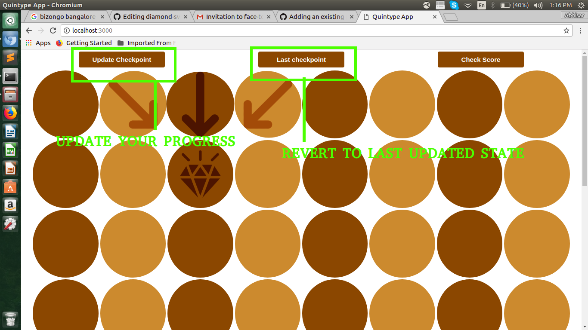
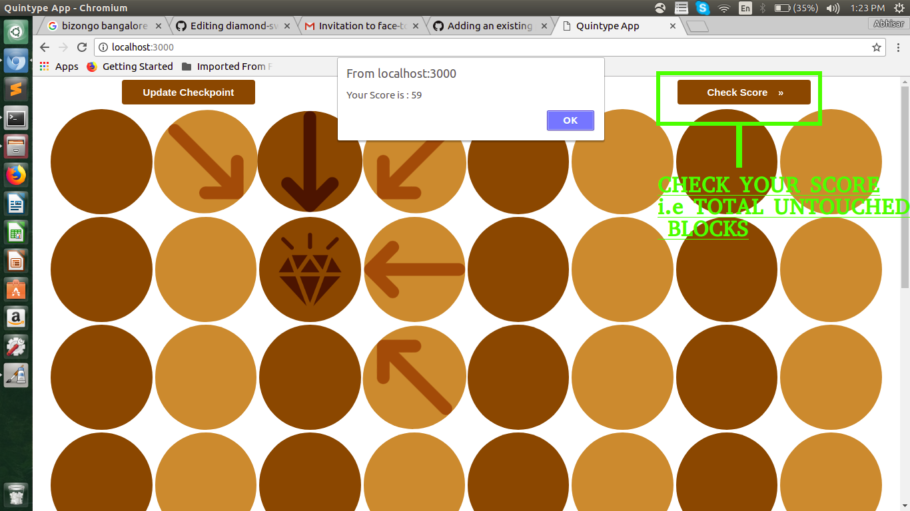
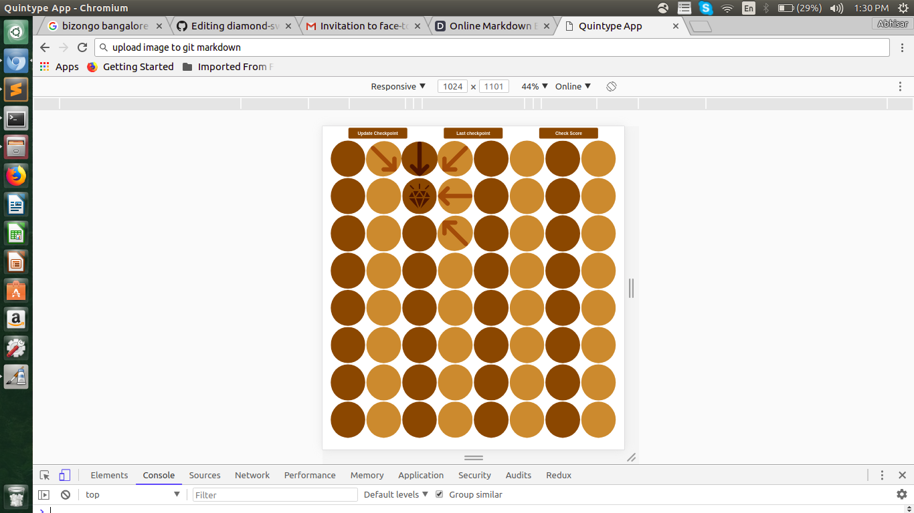

# Diamond SWeepers

Setup
```bash
$ git clone  https://github.com/abhisarautoninja/diamond-sweepers.git
$ cd diamond-sweeper/diamond-sweeper 
$ npm install
$ npm run compile
$ npm start
$ go to http://localhost:3000
```
# Features -:



